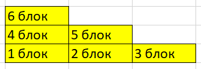

# Анонс #135. Пирамида

## Задача

Представьте, что вы строите правую сторону пирамиды (см.на рисунке ниже) из N блоков (на плоскости). В пирамиде на каждом верхнем уровне блоков меньше, чем на нижнем. Необходимо определить, сколько различных пирамид можно построить из N блоков.

### Входные данные

N - натуральное число от 1 до 100.

### Вывод

Кол-во всевозможных пирамид из N блоков

### Пример

    N = 3; Answer = 2
    N = 5; Answer = 3
    N = 6; Answer = 4
