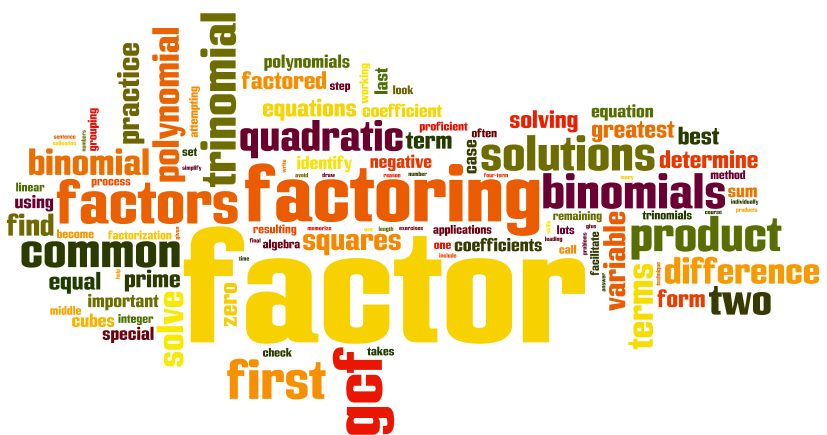

# Анонс #137. Multiplication of digits

  _Небольшая подсказка_  

## Задача

Дано натуральное число N. Необходимо найти наименьшее натуральное число, в ктр произведение его цифр было бы равно N. Если такого числа не существует, вывести -1.

### Входные данные

N - натуральное число от 1 до 10^9.

### Вывод

наименьшее натуральное число, произведение цифр ктр было бы равно N. -1 - если такого числа нет.

## Пример

N = 11; Answer = -1

N = 12; Answer = 26

N = 14; Answer = 27