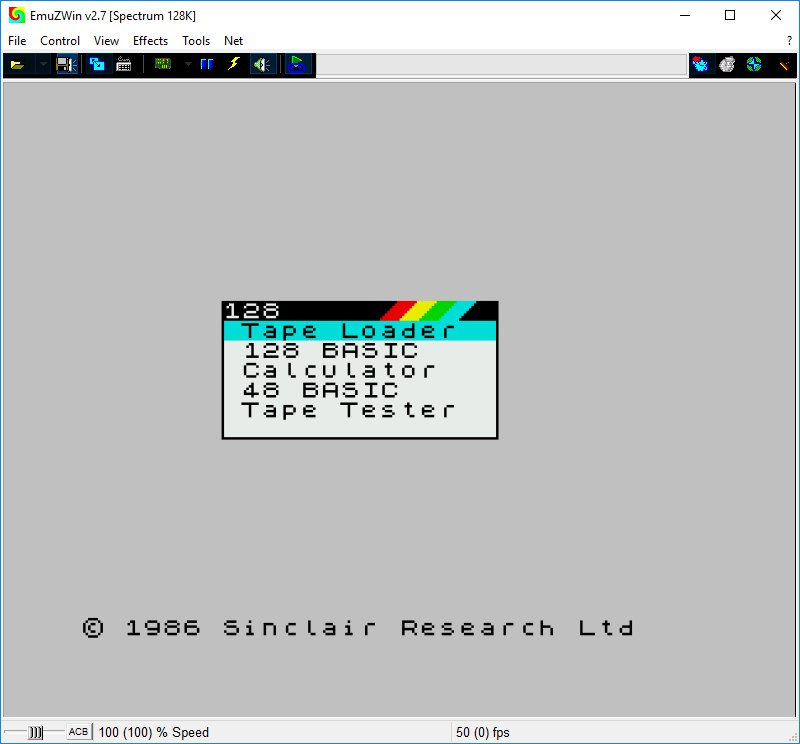

# Решение задачи на языке Basic (ZX Spectrum 48K)

**Old scool 4ever!!!**  

## Структура решения и вспомогательные файлы для тестов  

Для начала давайте разберемся что же [здесь](https://www.dropbox.com/sh/6df4tuzy232da52/AAD5tPLWDpcJ_6fUejnResNha?dl=0) находится. В папке с решением так же прилагаются дополнительные и вспомагательные файлы и папки:  

* [images](https://www.dropbox.com/sh/pnka02z0drvzckl/AAB12f4YEnLSmgMH0BrXJ63Ea?dl=0) - папка, в которой хранятся скриншоты с пошаговым запуском программы в эмуляторе.  
  

      
  
    _Первый запуск эмулятора_  

* [Utils](https://www.dropbox.com/sh/excbcnqj6d9eyfc/AABjehuJjARUsIg14iSf8RdLa?dl=0) - папка со вспомогательными утилитами, такими как:  
    - получить код из файла .SNA;  
    - конвертация TAPE файла (касеты) в .WAV, .MP3;  
    и т.д.  
      
* [ZX_Spectrum48_emulator](https://www.dropbox.com/sh/ccmdmytht4j9x28/AADxctyGQwyrMyWWUdavnGRAa?dl=0) - папка с архивом, в котором находится эмулятор, на котором я писал программу;  
  
* [hello.cpp](https://www.dropbox.com/s/h5o0svfqnj6h6f5/hello.cpp?dl=0) - это исходный код C++ программы, которая повтаряет алгоритм написанный на Basic. Этот файл создан для упрощения понимания кода Basic. Каждая строчка из Basic кода - имеет аналог на С++ в этом файле;  
  
* [task58basic_code.txt](https://www.dropbox.com/s/s1hlciz03gcrl3q/task58basic_code.txt?dl=0) - текстовый файл с оригинальным листингом программы на Basic;  
  
* [snapshot.sna](https://www.dropbox.com/s/biyw0nxqv0v7or7/snapshot.sna?dl=0) - снимок памяти эмулятора. С помощью этого файла можно загрузить программу практически в любой эмулятор;  
  
* [task58tape.tap](https://www.dropbox.com/s/i2bupow16vsb2w9/task58tape.tap?dl=0) - файл-образ аудио касеты, с записанной на нее программой. Так же может использоваться для загрузки программы в любой эмулятор;

* [task58tape.wav](https://www.dropbox.com/s/ksivh1b88fov278/task58tape.wav?dl=0) - аудио копия содержания файла-образа аудио касеты. Также может быть использован для загрузки программы в некоторые версии эмуляторов.

